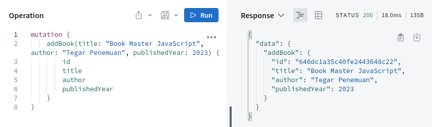
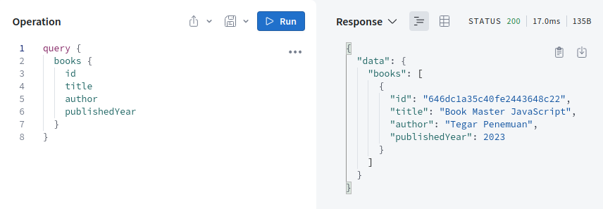
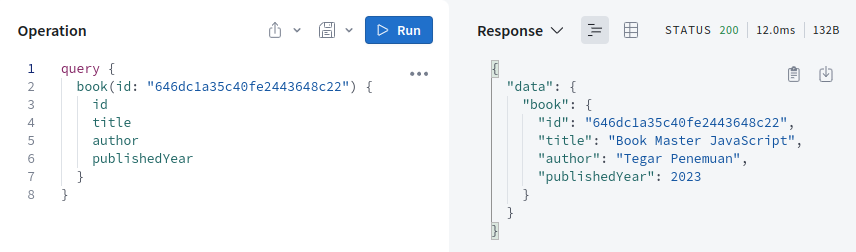
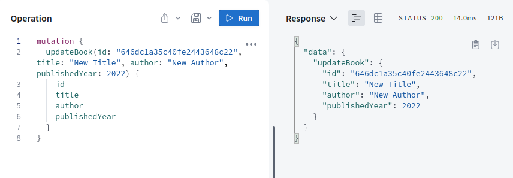
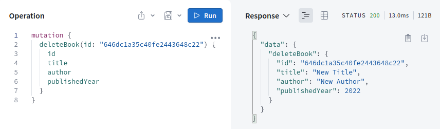

# Cara Instal

Silahkan **Clone Project**. Kemudian buka di teks editor dan lakukan **npm i** pada terminal.

# Testing

Untuk testing masuk dulu ke path **cd server/src** dan jalankan projeknya dengan **npm run dev**. Hasilnya di terminal akan muncul link silahkan tahan CTRL dan klik nanti akan dialihkan ke browser.

Untuk Mutation - Create

Untuk Query - Get All Data

Untuk Query - Get Data by ID

Untuk Mutation - Update Data

Untuk Mutation - Delete Data

